# Creating a MoveIt! config

## System requirements

- Ubuntu 18.04
- ROS Melodic

---

## The Xacro

We will create a arm + manipulator combo.

The manipulator will be a URDF sphere, since there are so many different options for manipulators and some of them require a lot more work to get them to work.

```xml
<?xml version="1.0"?>
<robot xmlns:xacro="http://www.ros.org/wiki/xacro" name="test">
    <xacro:include filename="$(find elfin_description)/urdf/elfin5.urdf.xacro" />

    <xacro:macro name="sph_tool" params="mass rad">
        <link name="sphere_tool">
            <inertial>
                <origin xyz="0.0 0.0 0.0" rpy="0.0 0.0 0.0"/>
                <mass value="${mass}"/>
                <inertia ixx="${(2/5)*(mass*rad**2)}" ixy="0.0" ixz="0.0" iyy="${(2/5)*(mass*rad**2)}" iyz="0.0" izz="${(2/5)*(mass*rad**2)}"/>
            </inertial>
            <visual>
                <origin xyz="0.0 0.0 ${rad}" rpy="0.0 0.0 0.0"/>
                <geometry>
                    <sphere radius="${rad}"/>
                </geometry>
                <material name="green">
                    <color rgba="0.0 1 0.0 1.0"/>
                </material>
            </visual>
            <collision>
                <origin xyz="0.0 0.0 ${rad}" rpy="0.0 0.0 0.0"/>
                <geometry>
                    <sphere radius="${rad}"/>
                </geometry>
            </collision>
        </link>

        <joint name="sphere_joint" type="fixed">
            <child link="sphere_tool" />
            <parent link="elfin_end_link" />
        </joint>
        </xacro:macro>

    <xacro:sph_tool mass="0.1" rad="0.04" />
</robot>
```

Save the file into `src/elfin_manipulator/samk/samk_description/urdf`, filename as `test.urdf.xacro`

It should look something like this in RViz, using the command 

`user@ubuntu:~/catkin_ws$ roslaunch samk_description display.launch model:=test`

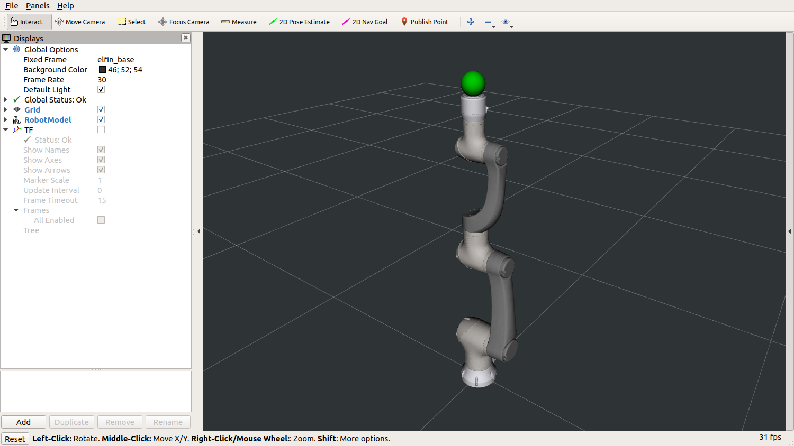

---

# MoveIt! setup assistant

## Load the robot

Launch the setup assistant, using the following command: `roslaunch moveit_setup_assistant setup_assistant.launch`

We need to load the URDF Xacro for our arm + tool description that we just created.


1. Click on the "Create new Moveit Configuration Package"
2. Browse to the urdf.xacro file we created.
3. Press the "Load files" button.

MoveIt setup assistant will load the robot description, parse it and tries to create a visual of it.

When the load is complete, go to the left and let's select the Self-Collisions panel.

---

## Self-Collisions

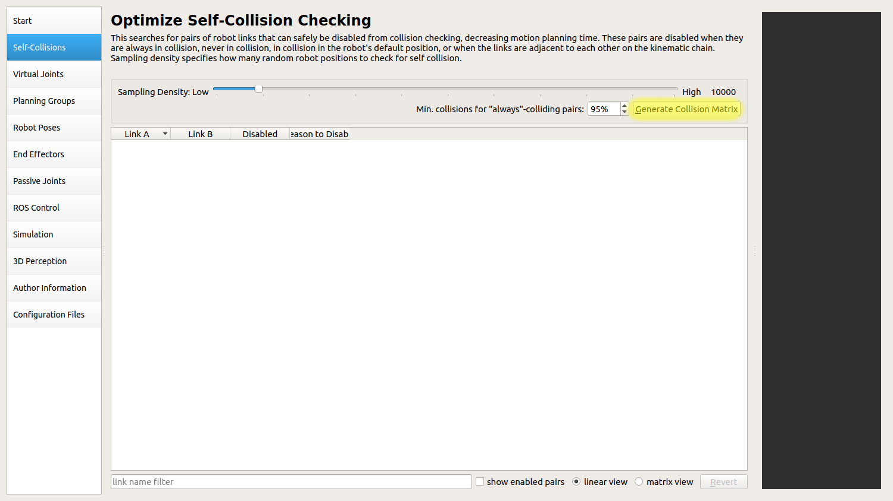

When we are creating a self-collision matrix, we need to consider the reason we are creating the configuration. If it is for simple testing of a concept, that it works and we can configure the model correctly, the default 10,000 sample density is sufficient. But, if we are creating for a production or the arm/tool combo is very complex, 100,000 samples might be needed.

After you pressed the `Generate Collision Matrix` button, you should see something like this:

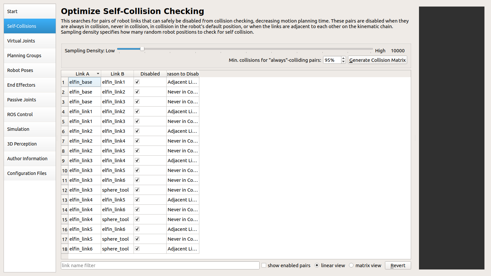

---

## Planning groups

We skip the Virtual joints part and move straight to planning groups.

Click Add group and we will start making our first group.

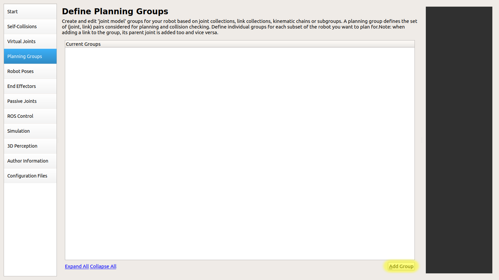

---

First, we have to give the group a name. Since this is going to be our arm that we are controlling, let's call it `elfin_arm`.

Next, there are many options for the kinematic solvers, but we are going to use the one created for Elfin arms, specifically the Elfin 5 arm. Select `elfin5_elfin_arm_kinematics/IKFastKinematicsPlugin`

Then select the joints, that are going to be part of the arm.

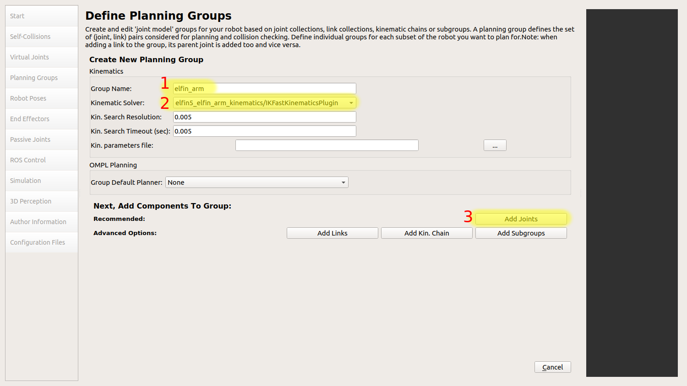

---

Select the 6 joints from the `elfin_joint`, then click the `>` button, to move them to selected joints bracket. Then save the selection.

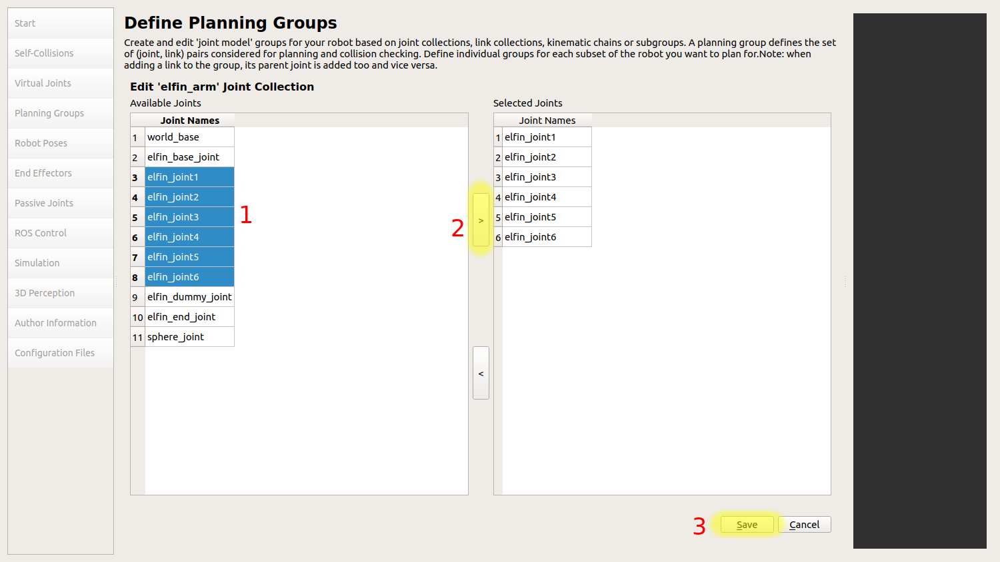

---

Let's add a link to the planning group, that we can use as a connection for our end effector.

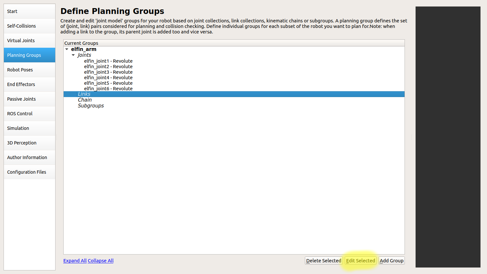

---

Select the `elfin_end_link` and move it to the selected links bracket and save the selection.

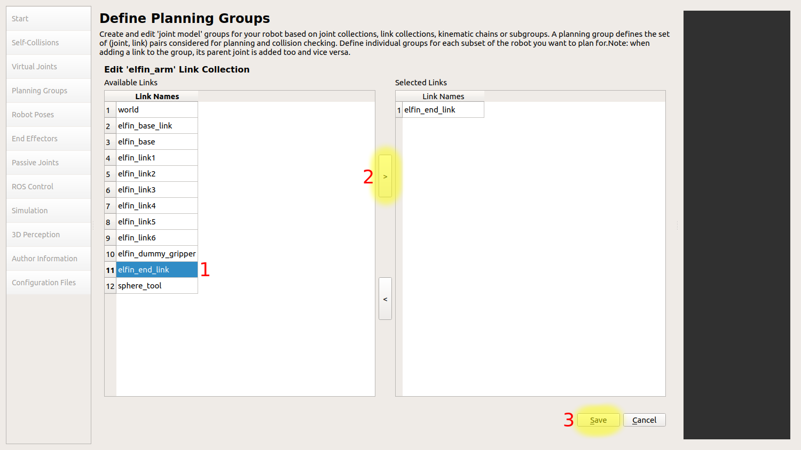

---

Let's make a new planning group, so that we can add it as an end effector.

Let's call the group as `tool_group`, but we won't add a kinematic solver, since it's only a single element that does not have any movement. Select the `sphere_joint` and add it to the selected joints bracket.

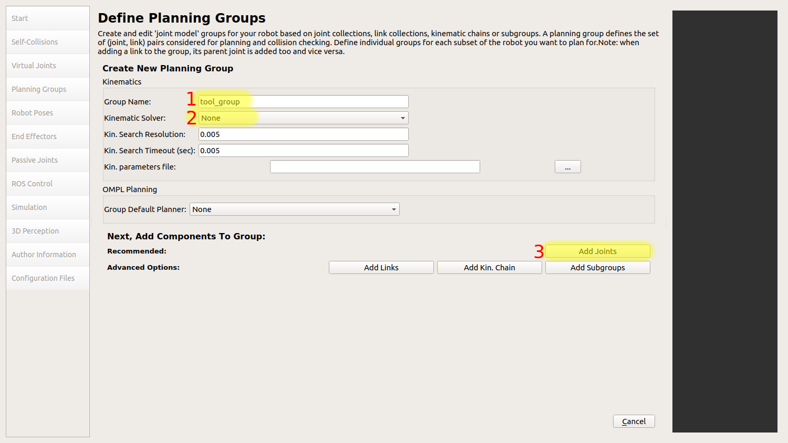

---

## Robot poses

After we have set the planning groups, we will move to set some poses, that we can use them as set points in simulations and testing. This will also be a good point, to test that all the required joints are moving.

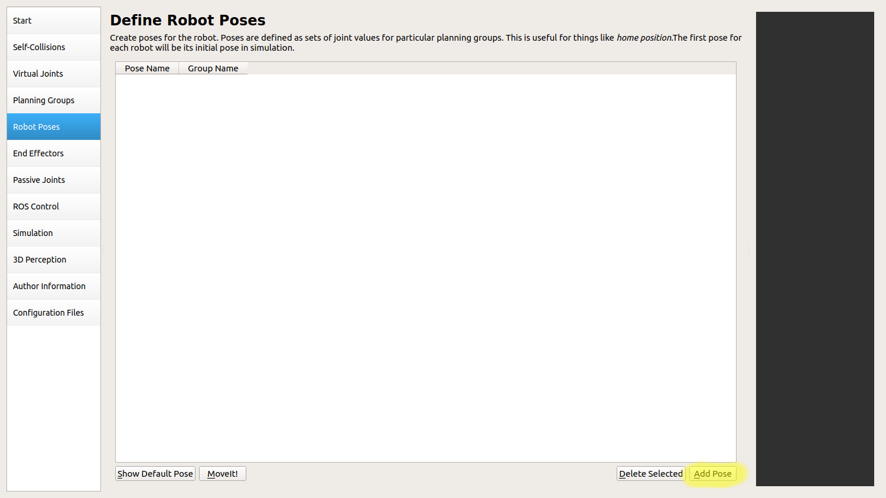

First, let's set a name for our pose. I will call it `home`.

Second, select the planning group. Since we only have the `elfin_arm` group that moves, we will use it.

Third, use the joint sliders and input boxes to set you pose to what you want.

And lastly, save the pose.

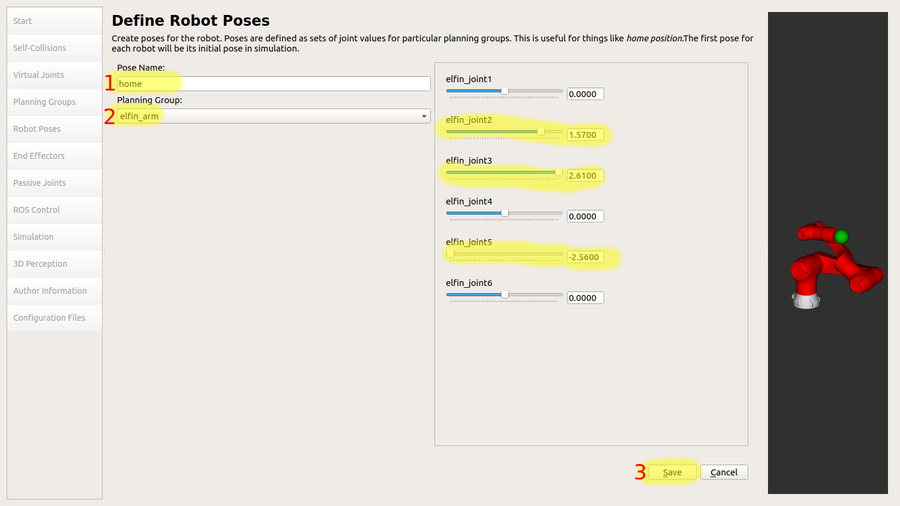

I will only use this one pose, but you can add multiple poses if you want. We will move from poses to end effectors.

---

## End Effectors

The end effector corresponds to the tool or a gripper, that is attached to an arm.

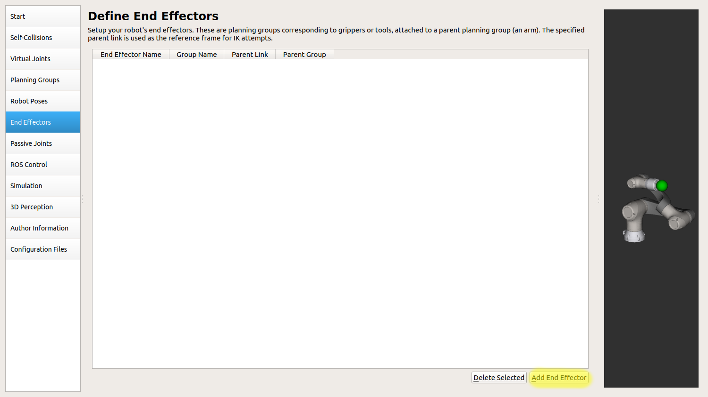

We have to define a name for our end effector, I will call it `tool_effector`

The end effectors group is `tool_group` that we defined earlier.

Parent link is the end of the elfin arm, where it would normally be connected.

The parent group is optional, but I like to define it and make sure that it follows the correct settings.

Click save and let's move to `ROS Control`

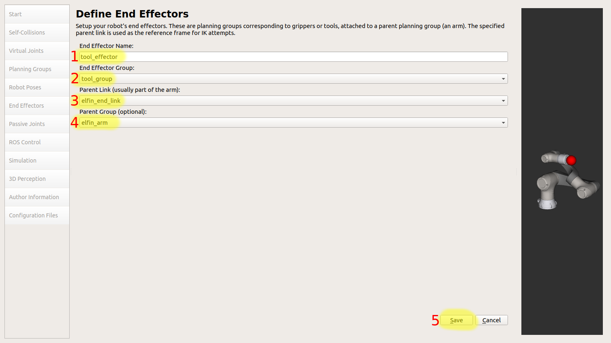

---

## Ros Controllers

There is straight an option to `Auto add FollowJointsTrajectory controllers for each planning group`, but we will not be using it, since we want to use  `position_controllers/JointTrajectoryController`.

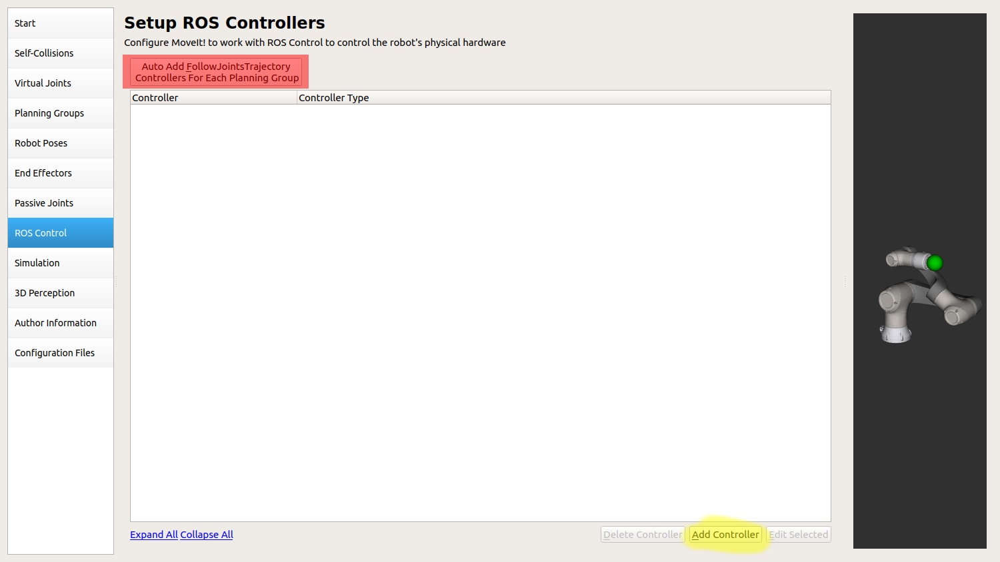

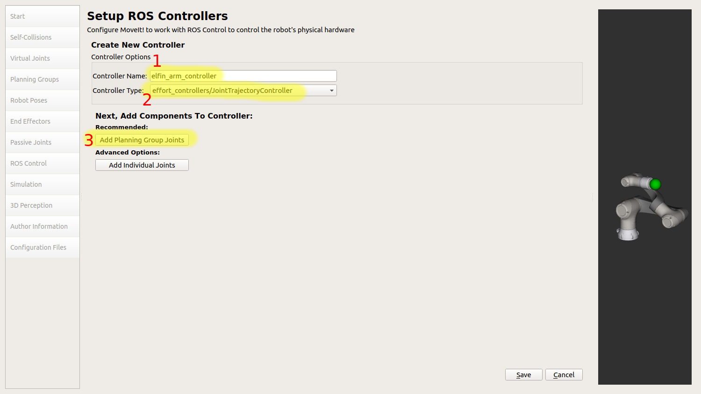

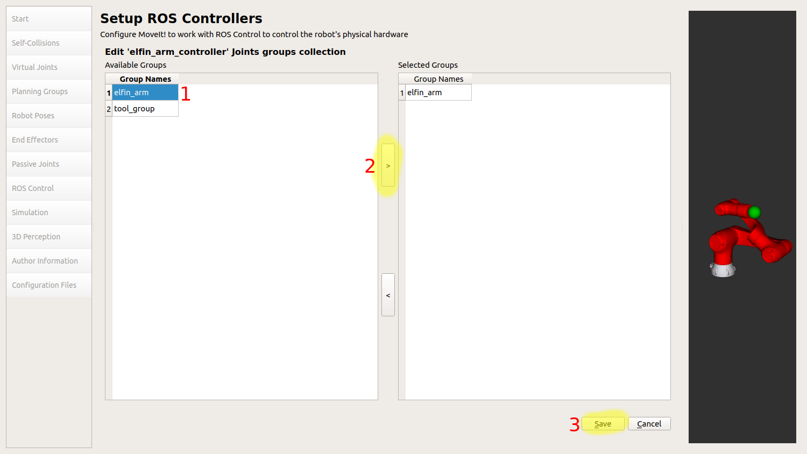

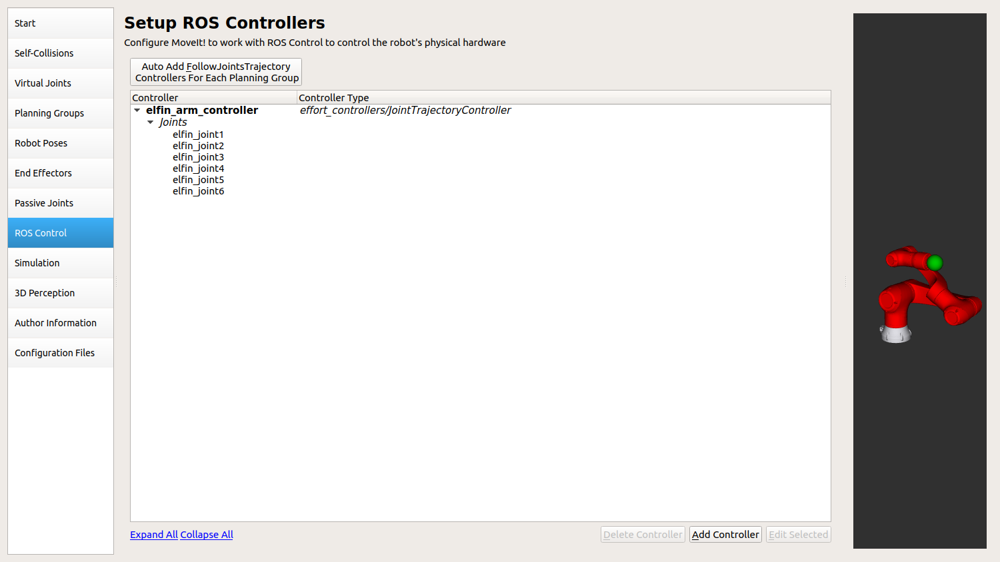

From here, we move to author information.

---

## Author information

There are just two fields, name and email. You can fill anything you like to these.

---

## Configuration files

Here, we browse to the `src` folder, where we want to save our MoveIt configurations. This can be any folder, as long as `catkin_make` can find it.

Pushing the `Generate package` button, creates the files and will prompt a warning, stating that we don't have any virtual joints added. But we don't need it. Just press OK and continue generating the files.

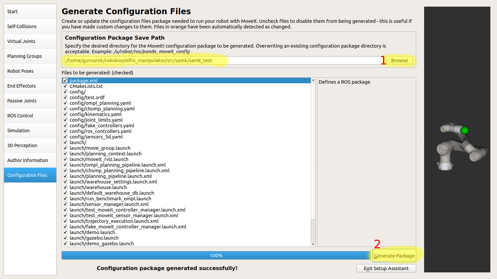

We can now exit the setup assistant.

---

# Modifying the moveit configuration

We need to create two launch files and modify existing code to work in Gazebo and RViz.

First, let's modify `ros_controllers.yaml` file, that is located in `src/elfin_manipulator/samk/samk_test/config` folder.

Find this part

```yaml
controller_list:
  []
```

and change it to this

```yaml
controller_list:
  - name: elfin_arm_controller
    action_ns: follow_joint_trajectory
    type: FollowJointTrajectory
    default: true
    joints:
      - elfin_joint1
      - elfin_joint2
      - elfin_joint3
      - elfin_joint4
      - elfin_joint5
      - elfin_joint6
```

This was the only modification we had to do. Next, we will create 2 launch files.

First we create `start_gazebo.launch` file

```xml
<?xml version="1.0"?>
<launch>
  <arg name="paused" default="false"/>
  <arg name="gazebo_gui" default="true"/>

  <!-- startup simulated world -->
  <include file="$(find gazebo_ros)/launch/empty_world.launch">
    <arg name="world_name" default="worlds/empty.world"/>
    <arg name="paused" value="$(arg paused)"/>
    <arg name="gui" value="$(arg gazebo_gui)"/>
    <arg name="verbose" value="false"/>
  </include>

  <!-- send robot urdf to param server -->
  <param name="robot_description" command="$(find xacro)/xacro '$(find samk_description)/urdf/test.urdf.xacro'"/>

  <!-- push robot_description to factory and spawn robot in gazebo at the origin, change x,y,z arguments to spawn in a different position -->
  <node name="spawn_gazebo_model" pkg="gazebo_ros" type="spawn_model" args="-urdf -param robot_description -model samk -x 0 -y 0 -z 0"
    respawn="false" output="screen" />

  <!-- Load joint controller configurations from YAML file to parameter server -->
  <rosparam file="$(find samk_test)/config/ros_controllers.yaml" command="load"/>

  <!-- Load the controllers -->
  <node name="controller_spawner" pkg="controller_manager" type="spawner" respawn="false" output="screen"
    args="
    joint_state_controller
    elfin_arm_controller
    --timeout 20" />

</launch>
```

Next file is `start_moveit.launch`

```xml
<launch>
  <!-- By default, we are not in debug mode -->
  <arg name="debug" default="false" />

  <!--
  By default, hide joint_state_publisher's GUI
  MoveIt!'s "demo" mode replaces the real robot driver with the joint_state_publisher.
  The latter one maintains and publishes the current joint configuration of the simulated robot.
  It also provides a GUI to move the simulated robot around "manually".
  This corresponds to moving around the real robot without the use of MoveIt.
  -->
  <arg name="use_gui" default="false" />
  <!-- Load the URDF, SRDF and other .yaml configuration files on the param server -->
  <include file="$(find samk_test)/launch/planning_context.launch">
    <arg name="load_robot_description" value="false"/>
  </include>

  <!-- If needed, broadcast static tf for robot root -->
  

  <!-- We do not have a robot connected, so publish fake joint states -->
  <node name="joint_state_publisher" pkg="joint_state_publisher" type="joint_state_publisher">
    <!-- <param name="use_gui" value="$(arg use_gui)" /> -->
    <param name="use_gui" value="false" />
    <!-- <rosparam param="source_list">[samk/joint_states]</rosparam> -->
    <rosparam param="source_list">[joint_states]</rosparam>
  </node>

  <!-- Given the published joint states, publish tf for the robot links -->
  <node name="robot_state_publisher" pkg="robot_state_publisher" type="robot_state_publisher" respawn="true" output="screen" />


  <!-- Run the main MoveIt! executable without trajectory execution (we do not have controllers configured by default) -->
  <include file="$(find samk_test)/launch/move_group.launch">
    <arg name="allow_trajectory_execution" value="true"/>
    <arg name="fake_execution" value="false"/>
    <arg name="info" value="true"/>
    <arg name="debug" value="$(arg debug)"/>
  </include>  

  <!-- Run Rviz and load the default config to see the state of the move_group node -->
  <include file="$(find samk_test)/launch/moveit_rviz.launch">
    <arg name="rviz_config" value="$(find samk_test)/launch/moveit.rviz"/>
    <arg name="debug" value="$(arg debug)"/>
  </include>
</launch>
```

You can use these as templates, when you create new arms, but remember to edit `samk_test` into the package you have created.

Launch order is

1. `user@ubuntu:~/catkin_ws/$ roslaunch samk_test start_gazebo.launch` (wait untill everything is loaded)
2. `user@ubuntu:~/catkin_ws/$ roslaunch samk_test start_moveit.launch`

__REMEMBER__ to `catkin_make` and `source devel/setup.bash`

---

Huge thank you to Tahsincan Koses article for helping making this work.

[Custom Manipulator Simulation in Gazebo and Motion Planning with MoveIt!](https://medium.com/@tahsincankose/custom-manipulator-simulation-in-gazebo-and-motion-planning-with-moveit-c017eef1ea90)
